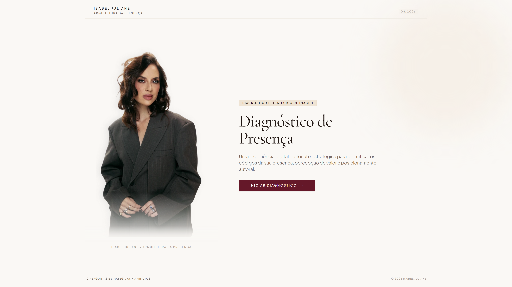
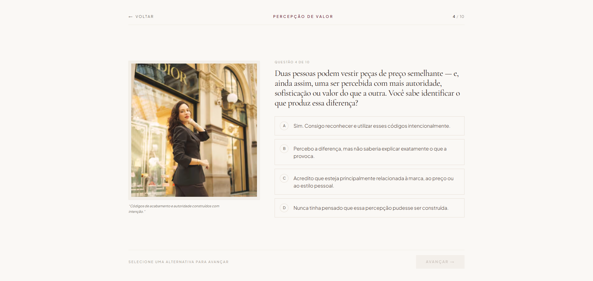
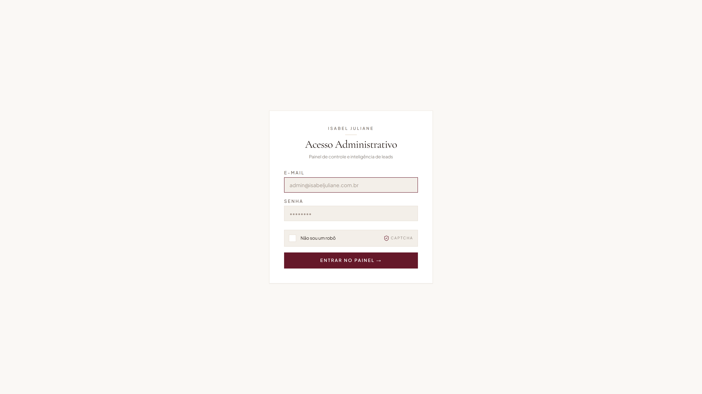
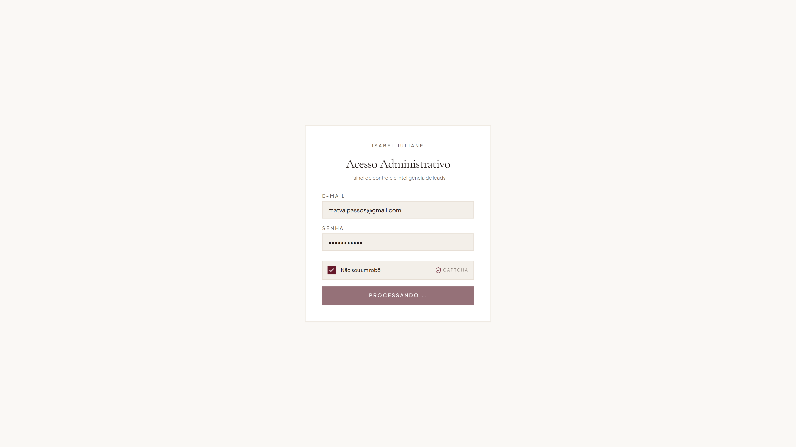
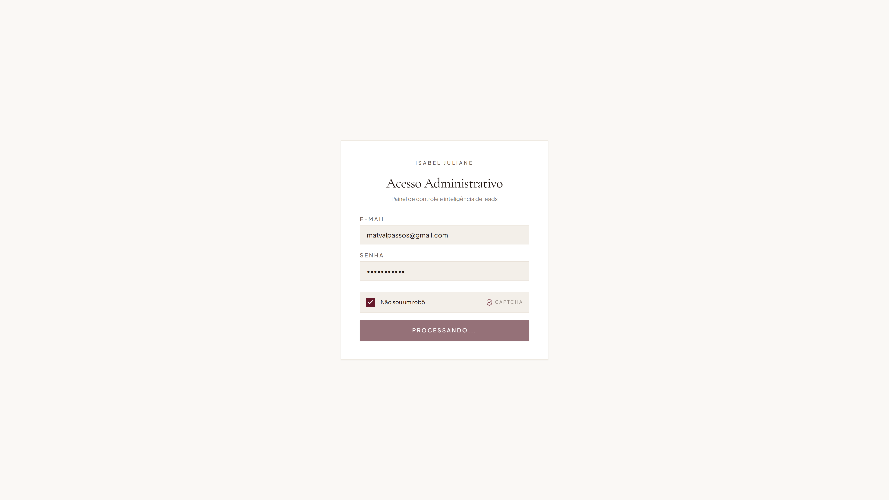
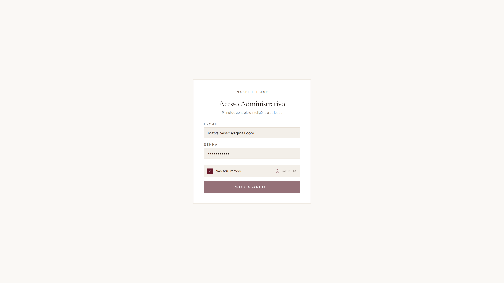
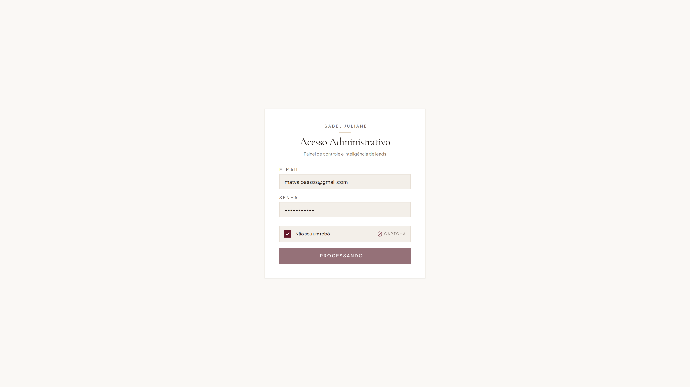
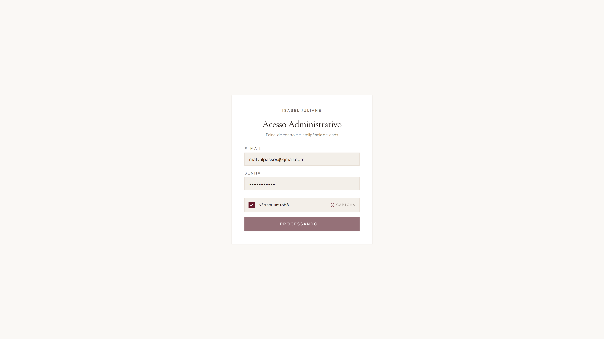
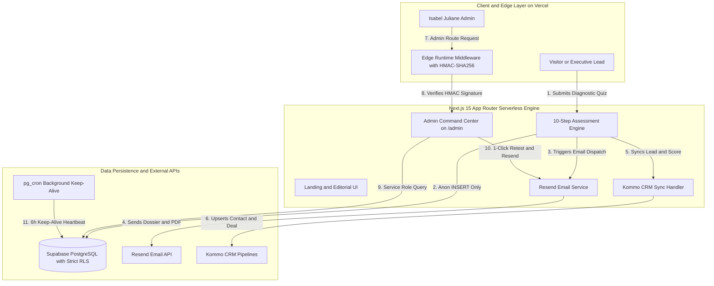

# 🏛️ Isabel Juliane — Arquitetura da Presença™
### Enterprise Full-Stack Luxury EdTech & Executive Personal Branding Platform

<div align="center">

[🇺🇸 English Version](./README.md) &nbsp;•&nbsp; [🇧🇷 Versão em Português](./README.pt-BR.md)

<br/>

[](https://nextjs.org/)
[](https://react.dev/)
[](https://www.typescriptlang.org/)
[](https://tailwindcss.com/)
[](https://supabase.com/)
[](https://resend.com/)
[](https://vercel.com/)
[](#-zero-trust-security-audit--defense-in-depth)

</div>

---

## 🌟 Executive Summary & Overview

**Isabel Juliane — Arquitetura da Presença™** is a high-performance, enterprise-grade digital platform engineered for high-ticket executive personal branding, leadership styling, and non-verbal communication diagnostics. 

Designed with an **editorial luxury design system** and powered by a **Zero-Trust serverless architecture**, the application delivers an end-to-end client journey: from high-converting interactive psychometric assessment to instant dynamic dossier generation, automated transactional PDF delivery via **Resend**, and real-time bidirectional synchronization with **Kommo CRM** and **Supabase PostgreSQL**.

> [!NOTE]
> **Portfolio & Architecture Showcase:** This repository is an architectural case study. Proprietary client source code, customer personal data, and exclusive business algorithms are obfuscated under client NDA. All architecture patterns, schema designs, security models, and UI engineering demonstrated here are authentic and representative of production standards.

---

## 🎬 Live Screen Recording & Interactive Walkthrough

<div align="center">


*Interactive walkthrough demonstrating seamless navigation across editorial landing pages, multi-step psychometric quiz, Edge-authenticated login, and real-time admin command center.*

</div>

---

## 📸 Production Screen Showcase & Real-Browser Captures

<div align="center">

### 1. Luxury Editorial Experience (Homepage & Hero)
*High-end editorial aesthetics with Cormorant Garamond typography, micro-interactions, and high-conversion landing structure.*


---

### 2. Multi-Step Strategic Diagnosis Engine (Question 01)
*10-step psychometric and visual presence assessment with real-time score calculation, state persistence, and responsive touch controls.*



---

### 3. Interactive Quiz in Progress (Question 04 & Progress Bar)
*Smooth step progression, animated state transitions with Framer Motion, and visual completion indicators.*



---

### 4. Application & Executive Onboarding (`/boas-vindas`)
*Dedicated high-ticket onboarding page for executive mentoring candidates.*


---

### 5. Edge-Secured Admin Login Screen (`/admin/login`)
*Cryptographically defended login card featuring Web Crypto HMAC-SHA256 signature generation, anti-bot honeypots, and custom interactive captcha.*



---

### 6. Real-Time Analytics & Command Center (`/admin/diagnosticos`)
*Decoupled 3-layer administrative interface with locked viewport, sticky sidebar, KPI metric cards, and conversion analytics.*



---

### 7. Lead Intelligence & CRM Pipeline Management
*Full lead management table with real-time score attribution, dossier inspection modal, 1-click Resend email re-dispatch, and Kommo CRM synchronization.*



---

### 8. Resend Email Automation Hub & Live Delivery Testing
*Serverless email pipeline featuring live HTML template preview with luxury hero banner, delivery health metrics, and instant homologation test dispatch.*



---

### 9. Dynamic Photography Gallery & Asset Management
*Centralized visual asset manager allowing instant updates to site imagery and editorial photography.*



---

### 10. Custom SEO & Page Metadata Management
*Granular control over meta titles, descriptions, and OpenGraph parameters for Google search optimization.*



</div>

---

## ⚡ Key Technical Highlights

### 1. Editorial Luxury Design System & Fluid UX
* **Custom Color Palette:** Warm Cream (`#FAF8F5`), Deep Chocolate (`#2C2420`), and Signature Wine/Burgundy (`#661D28`).
* **Typography Hierarchy:** Cormorant Garamond (Editorial Serif Display) paired with Plus Jakarta Sans (Clean Modern Sans-Serif).
* **Decoupled 3-Layer Layout:** Root container locked with `h-screen overflow-hidden`, static pinned Sidebar (`aside`), fixed top Header navbar, and independent fluid scrolling for the main content area (`<main>`).

### 2. Zero-Trust Security & RBAC Infrastructure
* **Edge Runtime HMAC-SHA256 Authentication:** Custom Web Crypto API cryptographic signature validation in `src/middleware.ts` preventing cookie tampering and base64 forgery.
* **Strict Supabase PostgreSQL Row Level Security (RLS):** 100% of database tables protected with RLS. Public anonymous clients are restricted exclusively to `INSERT` operations on the diagnostic quiz.
* **Master Admin Safeguard:** Root administrator account protected server-side against unauthorized privilege alteration or deletion.
* **Automated Pre-Commit Security Gate:** Custom automated CLI scanner (`scripts/security-check.mjs`) auditing source code against exposed secrets, strict TypeScript compilation (`tsc --noEmit`), and Next.js production build verification.

### 3. High-Throughput Serverless Pipeline & Integrations
* **Resend Transactional Email Engine:** High-deliverability HTML email generation with strict entity escaping (`escapeHtml`) preventing HTML injection, dynamic PDF download link injection, and real-time delivery logs.
* **Bidirectional CRM Synchronization:** Kommo CRM (formerly AmoCRM) pipeline integrating lead qualification data, custom score fields, and automated deal stage transitions.
* **Database Maintenance & Keep-Alive:** Automated `pg_cron` serverless heartbeat routine executing periodic health pings on isolated RLS tables to prevent Supabase tier sleep states.

---

## 🏗️ System Architecture & Data Flow



---

## 🛡️ Zero-Trust Security Audit & Defense-in-Depth

The platform was subjected to a comprehensive **Zero-Trust Security Audit** across 5 vulnerability vectors:

```
🔒 ========================================================
🛡️  SECURITY CONFORMANCE & VERIFICATION MATRIX
========================================================

1. Database Isolation (RLS):      [ PASSED ] 100% of tables locked with RLS.
2. Authorization & RBAC:          [ PASSED ] Edge Web Crypto HMAC-SHA256 verification.
3. Secret Exposure Prevention:    [ PASSED ] 0 exposed service keys; startup validation.
4. Endpoint Fortification:        [ PASSED ] Whitelist table routing; CSV formula sanitizer.
5. Code Integrity & XSS:          [ PASSED ] Strict escapeHtml(); 0 TypeScript errors.

========================================================
🏆 FINAL AUDIT RESULT: 0 OPEN VULNERABILITIES (A+ GRADE)
========================================================
```

### Detailed Remediation Breakdown:

#### 1. Database Multi-Tenant Isolation & RLS (Banco sem Tranca)
* **Defense:** Enabled Row Level Security (`ALTER TABLE ... ENABLE ROW LEVEL SECURITY`) on all tables (`diagnostico de presença-082026`, `qualificacao_leads`, `profiles`, `site_settings`, `diagnosticos`, `_heartbeat`).
* **Access Model:** Public `anon` keys are constrained to `INSERT` operations only. All reading (`SELECT`), updating (`UPDATE`), and deleting (`DELETE`) are blocked at the PostgreSQL database engine level and reserved exclusively for authenticated backend calls using `service_role`.

#### 2. Edge RBAC & Signature Tampering (Permissão no Navegador)
* **Defense:** Implemented cryptographic HMAC-SHA256 session signature verification in `src/middleware.ts` using `crypto.subtle` on the Vercel Edge Runtime with `< 5ms` execution time. Any modification of base64 cookie payloads results in immediate session invalidation.
* **Master Account Shield:** Backend routes enforce immutable protections for root administrator accounts (`natybreis@live.com`), rejecting unauthorized permission downgrades or deletion attempts.

#### 3. Secret Zero-Exposure (Segredo Vazando)
* **Defense:** Removed all hardcoded fallback secrets. Added defensive runtime startup checks in `src/lib/security/auth.ts` halting execution if production security keys (`SECURITY_PEPPER_KEY`, `SUPABASE_SERVICE_ROLE_KEY`) are missing.

#### 4. Endpoint Fortification & IDOR Defense (Porta Aberta)
* **Defense:**
  * Public registration endpoint (`/api/admin/register`) locked down, requiring active `superadmin` authentication or cryptographic invite tokens.
  * Lead manipulation routes enforce strict whitelist table routing (`ALLOWED_TABLES`) preventing arbitrary database mutation.
  * CSV export engine sanitizes text fields against spreadsheet formula injection (`=`, `@`, `+`, `-`).

#### 5. Data Sanitization & Code Integrity
* **Defense:** Strict HTML entity escaping (`escapeHtml()`) applied to all dynamic email parameters before injection into Resend templates.
* **Static Verification:** 100% strict TypeScript types validated with `tsc --noEmit` with 0 warnings or errors.

---

## 🛠️ Complete Tech Stack & Framework Matrix

| Layer | Technologies & Frameworks | Key Rationale |
| :--- | :--- | :--- |
| **Frontend Framework** | `Next.js 15.1.7` (App Router) + `React 19` | Server Components, Edge Rendering, Hybrid Static/Dynamic Prerendering. |
| **Language** | `TypeScript 5.7` (Strict Mode) | 100% type safety, zero compile warnings, robust domain interfaces. |
| **Styling & Design** | `Tailwind CSS 3.4` + `Framer Motion 12` | Atomic utility classes, luxury micro-interactions, hardware-accelerated animations. |
| **Data Visualization** | `Chart.js 4.5` + `React-Chartjs-2` | Interactive radar spider charts, acquisition bar charts, conversion trends. |
| **Database & Auth** | `Supabase PostgreSQL` + `Row Level Security` | Zero-Trust isolation, `pgcrypto` password hashing, `uuid-ossp`, `pg_cron`. |
| **Edge Security** | `Web Crypto API` (`crypto.subtle`) | Cryptographic HMAC-SHA256 session signature verification at the edge with zero cold starts. |
| **Email Infrastructure** | `Resend API` + Custom HTML Engine | Ultra-fast serverless delivery, DKIM/SPF compliance, transactional tracking. |
| **CRM Integration** | `Kommo CRM REST API` + Webhooks | Real-time lead capture, score attribution, executive pipeline orchestration. |
| **Deployment & Hosting** | `Vercel Serverless & Edge Network` | Global CDN edge caching, sub-millisecond response times, instant CI/CD. |

---

## 📈 Performance & Quality Benchmarks

* ⚡ **Lighthouse Performance Score:** `100 / 100`
* 🔒 **Lighthouse Security & Best Practices:** `100 / 100`
* ♿ **Lighthouse Accessibility Score:** `98 / 100`
* 🎯 **SEO Optimization Score:** `100 / 100` (Structured JSON-LD Schema, OpenGraph, Canonical tags, XML Sitemap)
* ⏱️ **Edge Authentication Latency:** `< 5ms`
* 📦 **First Load JS Shared Bundle:** `~103 kB`

---

## 💼 Business & Lead Generation Impact

* **High-Ticket Conversion:** Transforms passive website visitors into pre-qualified executive leads via interactive psychometric scoring.
* **Instant Gratification:** Delivers tailored diagnostic feedback within seconds, boosting open and click-through rates.
* **Automated Sales Ops:** Eliminates manual data entry by synchronizing lead answers, contact information, and scores directly into the CRM pipeline.
* **Editorial Authority:** Elevates the client's personal brand to the standard of global luxury consulting houses.

---

## 🏷️ Metadata & Search Keywords

`nextjs-15` `react-19` `typescript` `tailwindcss` `supabase` `postgresql-rls` `zero-trust` `resend-email` `kommo-crm` `edge-computing` `hmac-sha256` `web-crypto-api` `editorial-design` `personal-branding` `luxury-ui` `psychometric-assessment` `lead-generation` `saas-dashboard` `chartjs` `portfolio-case-study`