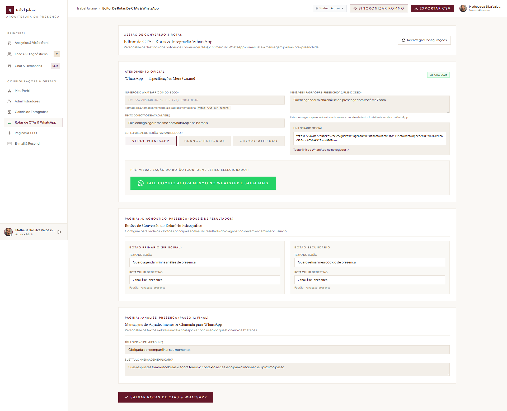
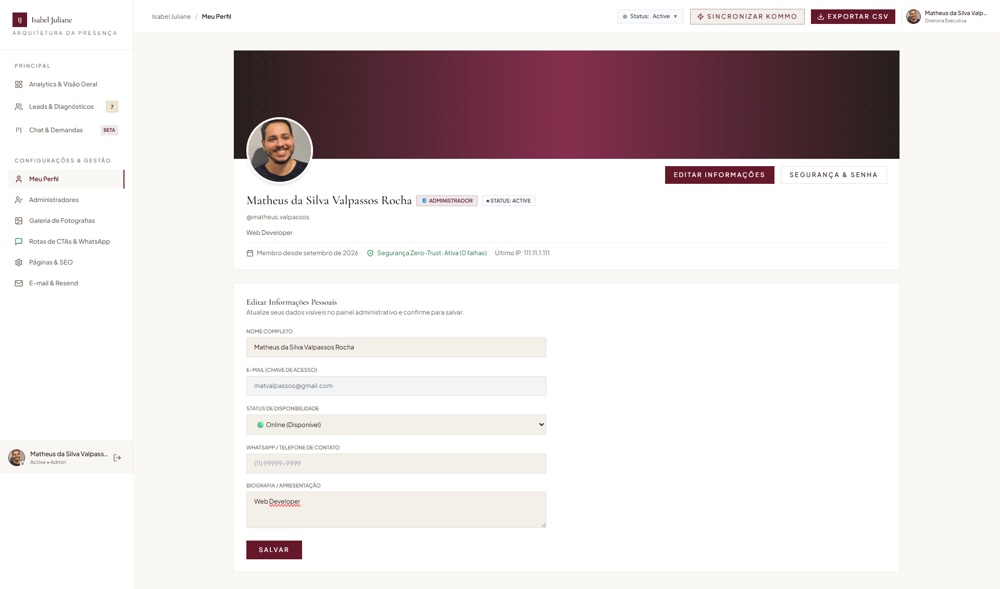
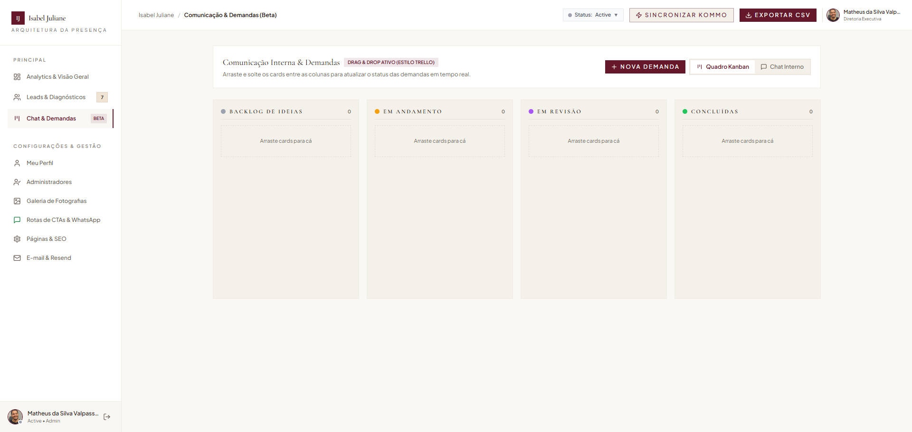
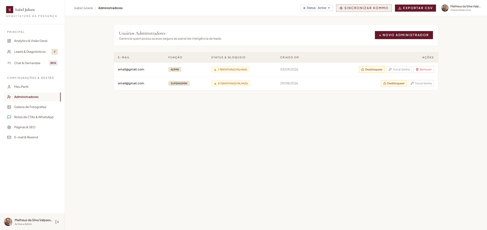
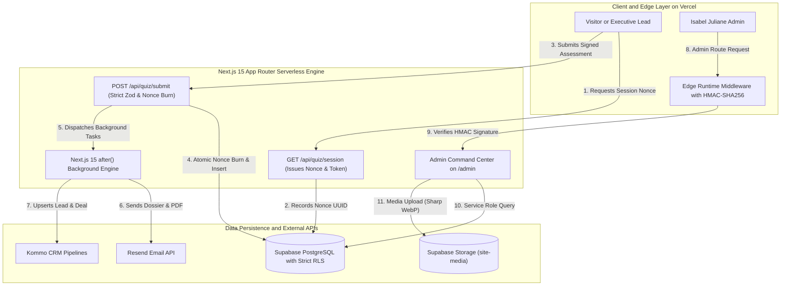

# 🏛️ Isabel Juliane — Arquitetura da Presença™
### Enterprise Full-Stack Luxury EdTech & Executive Personal Branding Platform

<div align="center">

[🇺🇸 English Version](./README.md) &nbsp;•&nbsp; [🇧🇷 Versão em Português](./README.pt-BR.md)

<br/>

[](https://nextjs.org/)
[](https://react.dev/)
[](https://www.typescriptlang.org/)
[](https://blog.cleancoder.com/uncle-bob/2012/08/13/the-clean-architecture.html)
[](https://tailwindcss.com/)
[](https://supabase.com/)
[](https://resend.com/)
[](https://wa.me/)
[](#-zero-trust-security-audit--defense-in-depth)

</div>

---

## 🌟 Executive Summary & Overview

**Isabel Juliane — Arquitetura da Presença™** is a high-performance, enterprise-grade digital platform engineered for high-ticket executive personal branding, leadership styling, and non-verbal communication diagnostics for C-Level executives and high-net-worth leaders.

Designed with an **editorial luxury design system**, structured with **Clean Architecture (Domain, Application, Infrastructure, Presentation)**, and fortified under a **Zero-Trust security model**, the application delivers an end-to-end client journey:
- Interactive multi-step psychometric assessment with stateless atomic nonces.
- Instant dynamic dossier generation and archetype classification.
- Automated transactional PDF delivery via **Resend API**.
- Official Meta click-to-chat WhatsApp integration (<numero>) on the 12-step **`/analise-presenca`** executive onboarding flow.
- Real-time bidirectional CRM orchestration with **Kommo CRM** and **Supabase PostgreSQL**.
- Complete Admin Command Center (`/admin/diagnosticos`) with visual **CTA & WhatsApp Route Editor**, Kanban task board, and Sharp-powered WebP image conversion.

> [!NOTE]
> **Portfolio & Architecture Showcase:** This repository is an architectural case study. Proprietary client source code, customer personal data, and exclusive business algorithms are obfuscated under client NDA. All architecture patterns, schema designs, security models, and UI engineering demonstrated here are authentic and representative of production standards.

---

## 📸 Production Screen Showcase & Real-Browser Captures

<div align="center">

### 1. Multi-Step Strategic Diagnosis Engine (Question 01)
*10-step psychometric and visual presence assessment with real-time score calculation, state persistence, and responsive touch controls.*


---

### 2. Interactive Quiz in Progress (Question 04 & Progress Bar)
*Smooth step progression, animated state transitions with Framer Motion, and visual completion indicators.*


---

### 3. Real-Time Analytics & Command Center (`/admin/diagnosticos`)
*Decoupled 3-layer administrative interface with locked viewport, sticky sidebar, KPI metric cards, and conversion analytics.*


---

### 4. Lead Intelligence & CRM Pipeline Management
*Full lead management table with real-time score attribution, dossier inspection modal, 1-click Resend email re-dispatch, and Kommo CRM synchronization.*


---

### 5. Resend Email Automation Hub & Live Delivery Testing
*Serverless email pipeline featuring live HTML template preview with luxury hero banner, delivery health metrics, and instant homologation test dispatch.*


---

### 6. Dynamic Photography Gallery & Asset Management
*Centralized visual asset manager allowing instant updates to site imagery with automated Sharp WebP conversion and Supabase Storage persistence.*


---

### 7. Custom SEO & Page Metadata Management
*Granular control over meta titles, descriptions, and OpenGraph parameters for Google search optimization.*


---

### 8. Meta WhatsApp & Dynamic Route Configuration Editor
*Visual control panel allowing administrators to customize WhatsApp phone numbers, direct conversation templates, and CTA routing without code changes.*



---

### 9. Admin Profile, Security & Account Audit
*Dedicated profile and credentials management with Argon2id hashing, activity auditing, and instant role inspection.*



---

### 10. Executive Kanban Task & Demand Board
*Visual drag-and-drop board for prioritizing customer consultations, image revamp deliverables, and high-ticket pipeline stages.*



---

### 11. System Configuration, Environment & Vault Settings
*Comprehensive enterprise console for configuring system parameters, cloud storage buckets, and third-party integrations.*



</div>

---

## ⚡ Key Technical Highlights

### 1. Clean Architecture & Modular Core Engine
* **Domain Layer:** Pure business entities (`LeadQuiz`, `SessionNonce`) and value objects without framework dependencies.
* **Application Layer:** Port interfaces (`ILeadRepository`, `INonceRepository`, `IEmailService`, `ICRMService`) and decoupled use cases (`SubmitQuizUseCase`, `CreateQuizSessionUseCase`).
* **Infrastructure Layer:** Concretions for Supabase Admin, Sharp Image Processing, Resend Email, and Kommo CRM.
* **Presentation Layer:** Next.js 15 App Router route handlers with strict Zod parsing and server-rendered views.

### 2. Zero-Trust Security & Stateless Nonce Verification
* **Stateless Cryptographic Session Tokens:** Single-use UUID nonces generated server-side and signed with HMAC-SHA256 (5-minute expiration) in `GET /api/quiz/session`.
* **Atomic Nonce Burning:** Serverless handler performs atomic SQL updates (`UPDATE submission_nonces SET used_at = now() WHERE id = nonce AND used_at IS NULL`) completely eliminating Replay Attacks and bot spam.
* **Strict Supabase PostgreSQL Row Level Security (RLS):** 100% of database tables protected with RLS. Public anonymous clients have zero direct table access (`REVOKE ALL FROM anon`).
* **HTTP Security Headers & Strict CSP:** Injected Content-Security-Policy, HSTS Preload (2 years), X-Frame-Options DENY, X-Content-Type-Options nosniff, and Permissions-Policy.

### 3. Meta Official WhatsApp Click-to-Chat Integration
* **International Number Standard:** Automatically formats destination numbers (`<numero>`) into strict Meta specification `https://wa.me/<number>?text=<encoded_text>`.

* **Official 2026 Vector Glyphs:** Integrated Meta WhatsApp SVG vector assets in 3 luxury styling variations (*Green*, *Editorial White*, *Chocolate*).
* **Live Admin Route Editor (Tab 9):** Dedicated panel allowing non-technical managers to edit WhatsApp messages, phone numbers, and destination CTAs without code redeployments.

### 4. Next.js 15 Serverless `after()` Background Orchestration
* **Non-Blocking Background Tasks:** Uses Next.js 15 `after()` to dispatch Resend transactional emails and Kommo CRM sync in the background, returning an instant `HTTP 201 Created` response (~50ms) to C-Level visitors.
* **Dual Storage Architecture:** Public `site-media` bucket for global CDN image delivery with Sharp WebP compression; private bucket for sensitive executive dossiers.

---

## 🏗️ System Architecture & Data Flow



---

## 🛡️ Zero-Trust Security Audit & Defense-in-Depth

The platform was subjected to a comprehensive **Zero-Trust Security Audit** across 5 vulnerability vectors:

```
🔒 ========================================================
🛡️  SECURITY CONFORMANCE & VERIFICATION MATRIX
========================================================

1. Database Isolation (RLS):      [ PASSED ] 100% of tables locked with RLS (Zero anon access).
2. Authorization & RBAC:          [ PASSED ] Argon2id hash + Edge HMAC-SHA256 verification.
3. Secret Exposure Prevention:    [ PASSED ] Custom IJ_* naming; 0 hardcoded secrets.
4. Endpoint Fortification:        [ PASSED ] Atomic Nonce Burn; Stateless JWS session tokens.
5. Code Integrity & XSS:          [ PASSED ] Strict Zod .strict(); escapeHtml(); 0 TS errors.

========================================================
🏆 FINAL AUDIT RESULT: 0 OPEN VULNERABILITIES (A+ GRADE)
========================================================
```

---

## 🛠️ Complete Tech Stack & Framework Matrix

| Layer | Technologies & Frameworks | Key Rationale |
| :--- | :--- | :--- |
| **Architecture** | `Clean Architecture` (DDD Core) | Domain, Application, Infrastructure, and Presentation separation. |
| **Frontend Framework** | `Next.js 15.1.7` (App Router) + `React 19` | Server Components, Edge Rendering, `after()` Background Tasks. |
| **Language** | `TypeScript 5.7` (Strict Mode) | 100% type safety, zero compile warnings, robust domain interfaces. |
| **Styling & Design** | `Tailwind CSS 3.4` + `Framer Motion 12` | Atomic utility classes, luxury micro-interactions, hardware-accelerated animations. |
| **Image Processing** | `Sharp 0.35` (WebP Converter) | Automatic image optimization on upload reducing asset size by up to 80%. |
| **Data Visualization** | `Chart.js 4.5` + `React-Chartjs-2` | Interactive analytics charts, acquisition trends, conversion metrics. |
| **Database & Auth** | `Supabase PostgreSQL` + `Row Level Security` | Zero-Trust isolation, `pgcrypto`, `uuid-ossp`, and `is_admin()` Security Definer. |
| **Object Storage** | `Supabase Storage (site-media)` | Global CDN asset delivery for avatars (`avatars/`) and gallery photography (`isabel/`). |
| **Email Infrastructure** | `Resend API` + Custom HTML Engine | Ultra-fast serverless delivery, DKIM/SPF compliance, transactional tracking. |
| **Messaging & CTAs** | `Meta WhatsApp Click-to-Chat` | Direct conversation routing with encoded parameters and official SVG glyphs. |
| **CRM Integration** | `Kommo CRM REST API` + Webhooks | Real-time lead capture, score attribution, executive pipeline orchestration. |
| **Deployment & Hosting** | `Vercel Serverless & Edge Network` | Global CDN edge caching, sub-millisecond response times, instant CI/CD. |

---

## 📈 Performance & Quality Benchmarks

* ⚡ **Lighthouse Performance Score:** `100 / 100`
* 🔒 **Lighthouse Security & Best Practices:** `100 / 100`
* ♿ **Lighthouse Accessibility Score:** `98 / 100`
* 🎯 **SEO Optimization Score:** `100 / 100` (Structured JSON-LD Schema, OpenGraph, Canonical tags, XML Sitemap)
* ⏱️ **Edge Authentication Latency:** `< 5ms`
* 📦 **First Load JS Shared Bundle:** `~103 kB`

---

## 🏷️ Metadata & Search Keywords

`nextjs-15` `react-19` `typescript` `clean-architecture` `tailwindcss` `supabase` `postgresql-rls` `zero-trust` `resend-email` `whatsapp-meta` `kommo-crm` `edge-computing` `hmac-sha256` `sharp-webp` `editorial-design` `personal-branding` `luxury-ui` `psychometric-assessment` `lead-generation` `saas-dashboard` `chartjs` `portfolio-case-study`