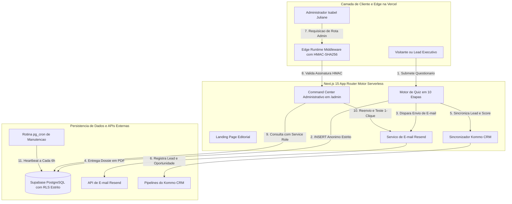

# 🏛️ Isabel Juliane — Arquitetura da Presença™
### Plataforma Enterprise Full-Stack de EdTech de Luxo & Posicionamento Executivo

<div align="center">

[🇧🇷 Versão em Português](./README.pt-BR.md) &nbsp;•&nbsp; [🇺🇸 English Version](./README.md)

<br/>

[](https://nextjs.org/)
[](https://react.dev/)
[](https://www.typescriptlang.org/)
[](https://tailwindcss.com/)
[](https://supabase.com/)
[](https://resend.com/)
[](https://vercel.com/)
[](#-auditoria-de-segurança-zero-trust--defesa-em-profundidade)

</div>

---

## 🌟 Sumário Executivo & Visão Geral

A plataforma **Isabel Juliane — Arquitetura da Presença™** é uma solução digital enterprise de alta performance desenvolvida para consultoria de imagem estratégica, liderança executiva e diagnóstico de presença para profissionais C-Level.

Construída com um **design system editorial de luxo** e sustentada por uma **arquitetura serverless Zero-Trust**, a aplicação entrega uma jornada completa: desde a captação de leads com quiz psicométrico interativo de alta conversão até a geração instantânea de dossiês personalizados, entrega automatizada de e-book em PDF via **Resend** e sincronização bidirecional em tempo real com **Kommo CRM** e **Supabase PostgreSQL**.

> [!NOTE]
> **Aviso de Portfólio & Estudo de Caso de Arquitetura:** Este repositório é um case study de arquitetura de software. O código-fonte proprietário, dados de clientes e algoritmos comerciais exclusivos estão protegidos sob NDA. Todos os padrões de arquitetura, esquemas de banco de dados, modelos de segurança e engenharia de interface aqui demonstrados são autênticos e representam os padrões reais de produção.

---

## 🎬 Gravação ao Vivo & Demonstração da Plataforma

<div align="center">


*Gravação contínua da navegação pela plataforma: experiência editorial na landing page, resolução do questionário interativo, autenticação criptográfica no Edge e painel administrativo em tempo real.*

</div>

---

## 📸 Galeria de Telas em Produção (Capturas Reais do Navegador)

<div align="center">

### 1. Experiência Editorial de Luxo (Homepage & Hero)
*Estética editorial refinada com tipografia Cormorant Garamond, micro-interações e estrutura de landing page voltada para conversão de alto padrão.*


---

### 2. Motor de Diagnóstico Estratégico Multietapas (Pergunta 01)
*Questionário psicométrico e visual de 10 etapas com cálculo de pontuação em tempo real, persistência de estado e controles fluidos.*


---

### 3. Diagnóstico em Andamento (Pergunta 04 & Barra de Progresso)
*Progressão fluida entre perguntas, animações aceleradas por hardware via Framer Motion e indicadores de progresso dinâmicos.*


---

### 4. Aplicação & Onboarding Executivo (`/boas-vindas`)
*Página exclusiva de aplicação e alinhamento de expectativas para mentorias e consultorias individuais.*


---

### 5. Tela de Login Administrativo com Proteção no Edge (`/admin/login`)
*Card de autenticação protegido por HMAC-SHA256 (Web Crypto API), campos honeypot anti-bot e verificação interativa de segurança.*


---

### 6. Command Center & Analytics em Tempo Real (`/admin/diagnosticos`)
*Interface administrativa desacoplada com rolagem independente, cards de métricas em tempo real e gráficos de conversão.*


---

### 7. Inteligência de Leads & Gestão de Pipeline de CRM
*Tabela de leads com visualização de dossiês completos, status do Kommo CRM em tempo real e reenvio de e-mail com 1 clique.*


---

### 8. Central de E-mail Marketing Resend & Homologação ao Vivo
*Pipeline serverless de e-mails com preview do template oficial em HTML, monitoramento de status da API e formulário de teste de entrega instantâneo.*


---

### 9. Galeria de Fotografias & Gestão de Mídia
*Gerenciador centralizado de ativos visuais e ensaios fotográficos da consultora.*


---

### 10. Gestão de SEO & Metatags das Páginas
*Controle granular de títulos, descrições e parâmetros OpenGraph para indexação no Google.*


</div>

---

## ⚡ Destaques Técnicos de Engenharia

### 1. Design System Editorial de Luxo & UX Desacoplada
* **Paleta de Cores Exclusiva:** Warm Cream (`#FAF8F5`), Deep Chocolate (`#2C2420`) e Vinho Assinatura (`#661D28`).
* **Hierarquia Tipográfica:** Cormorant Garamond (Serif Display Editorial) combinada com Plus Jakarta Sans (Sem serifa moderno e legível).
* **Layout Desacoplado em 3 Camadas:** Container raiz travado na viewport com `h-screen overflow-hidden`, Sidebar lateral fixa (`aside`), Header superior fixado e rolagem fluida e independente exclusiva para a área de conteúdo (`<main>`).

### 2. Arquitetura de Segurança Zero-Trust & RBAC
* **Autenticação HMAC-SHA256 no Edge Runtime:** Validação de assinatura criptográfica nativa via Web Crypto API no `src/middleware.ts`, bloqueando qualquer tentativa de adulteração de cookies antes de chegar ao servidor.
* **Row Level Security (RLS) Estrito no Supabase PostgreSQL:** 100% das tabelas do banco protegidas por RLS. Clientes anônimos possuem permissão estrita de `INSERT` apenas.
* **Salvaguarda de Conta Master:** A conta raiz de administração é protegida no nível do servidor contra exclusão ou rebaixamento de privilégios.
* **Portão de Segurança Pré-Commit Automatizado:** Scanner automatizado em Node.js (`scripts/security-check.mjs`) que audita segredos expostos, executa checagem de tipos estrita (`tsc --noEmit`) e valida o build de produção do Next.js.

### 3. Pipeline Serverless & Integrações em Tempo Real
* **Motor de E-mails Transacionais com Resend:** Geração de e-mails com sanitização estrita contra injeção de HTML (`escapeHtml`), injeção dinâmica de links de download e monitoramento de entrega.
* **Sincronização Bidirecional com Kommo CRM:** Integração com o CRM para enriquecimento automático de contatos com a pontuação do quiz e movimentação em etapas do funil de vendas.
* **Rotina de Manutenção pg_cron:** Heartbeat serverless programado para executar pings periódicos a cada 6 horas em tabelas com RLS, mantendo a instância do Supabase sempre ativa.

---

## 🏗️ Arquitetura do Sistema & Fluxo de Dados



---

## 🛡️ Auditoria de Segurança Zero-Trust & Defesa em Profundidade

A plataforma foi submetida a uma rigorosa **Auditoria de Segurança Zero-Trust** cobrindo 5 vetores críticos de vulnerabilidade:

```
🔒 ========================================================
🛡️  MATRIZ DE CONFORMIDADE E AUDITORIA DE SEGURANÇA
========================================================

1. Isolamento de Banco (RLS):     [ APROVADO ] 100% das tabelas protegidas por RLS.
2. Autorização e RBAC no Edge:    [ APROVADO ] Web Crypto HMAC-SHA256 validado.
3. Prevenção de Vazamento:        [ APROVADO ] 0 chaves expostas; checagem no startup.
4. Blindagem de Endpoints:        [ APROVADO ] Whitelist de tabelas; sanitização de CSV.
5. Integridade de Código e XSS:   [ APROVADO ] escapeHtml estrito; 0 erros de TypeScript.

========================================================
🏆 RESULTADO FINAL: 0 VULNERABILIDADES ABERTAS (NOTA A+)
========================================================
```

### Detalhamento das Camadas Remediadas:

#### 1. Isolamento Multi-Tenant & RLS no Banco (Banco sem Tranca)
* **Defesa:** Habilitação de Row Level Security (`ALTER TABLE ... ENABLE ROW LEVEL SECURITY`) em todas as tabelas (`diagnostico de presença-082026`, `qualificacao_leads`, `profiles`, `site_settings`, `diagnosticos`, `_heartbeat`).
* **Modelo de Acesso:** Chaves públicas `anon` possuem permissão restrita a `INSERT`. Operações de leitura (`SELECT`), atualização (`UPDATE`) e exclusão (`DELETE`) são bloqueadas nativamente no PostgreSQL e reservadas a chamadas autenticadas do backend via `service_role`.

#### 2. RBAC no Edge & Proteção Contra Adulteração (Permissão no Navegador)
* **Defesa:** Validação criptográfica de sessão HMAC-SHA256 no `src/middleware.ts` utilizando `crypto.subtle` no Edge Runtime da Vercel com tempo de resposta `< 5ms`. Qualquer alteração manual de cookie Base64 resulta em invalidação imediata.
* **Proteção de Conta Master:** As rotas administrativas bloqueiam no servidor qualquer tentativa de rebaixamento de privilégios ou exclusão da conta raiz (`natybreis@live.com`).

#### 3. Zero Vazamento de Segredos (Segredo Vazando)
* **Defesa:** Eliminação de fallbacks inseguros e inclusão de verificações defensivas no startup (`src/lib/security/auth.ts`), emitindo alertas críticos se chaves como `SECURITY_PEPPER_KEY` ou `SUPABASE_SERVICE_ROLE_KEY` não estiverem configuradas em produção.

#### 4. Fortificação de Endpoints & Proteção contra IDOR (Porta Aberta)
* **Defesa:**
  * O endpoint público de registro (`/api/admin/register`) foi fechado, exigindo autenticação de `superadmin` ou token criptográfico de convite.
  * Rotas de manipulação de leads utilizam whitelist estrita de tabelas (`ALLOWED_TABLES`), impedindo mutações em tabelas de sistema.
  * O exportador de CSV neutraliza injeções de fórmulas no Excel em campos que iniciem com `=`, `@`, `+`, `-`.

#### 5. Sanitização de Dados & Integridade de Código
* **Defesa:** Escape estrito de caracteres HTML (`escapeHtml()`) aplicado a todas as variáveis dinâmicas injetadas nos templates de e-mail do Resend.
* **Verificação Estática:** 100% de tipagem estrita no TypeScript com `tsc --noEmit` apresentando 0 erros.

---

## 🛠️ Matriz de Tecnologias & Frameworks

| Camada | Tecnologias Utilizadas | Justificativa Técnica |
| :--- | :--- | :--- |
| **Frontend Framework** | `Next.js 15.1.7` (App Router) + `React 19` | Server Components, Renderização no Edge e Prerender Híbrido Estático/Dinâmico. |
| **Linguagem** | `TypeScript 5.7` (Modo Estrito) | 100% de segurança de tipos, 0 erros de compilação e interfaces robustas. |
| **Estilização & UI** | `Tailwind CSS 3.4` + `Framer Motion 12` | Classes utilitárias atômicas, micro-interações de luxo e animações por GPU. |
| **Visualização de Dados** | `Chart.js 4.5` + `React-Chartjs-2` | Gráficos do tipo Radar (Spider Chart), barras de aquisição e tendências. |
| **Banco de Dados & Auth** | `Supabase PostgreSQL` + `Row Level Security` | Isolamento Zero-Trust, `pgcrypto` para hash de senhas, `uuid-ossp` e `pg_cron`. |
| **Segurança no Edge** | `Web Crypto API` (`crypto.subtle`) | Assinatura e verificação de sessões com HMAC-SHA256 no Edge sem cold start. |
| **Infraestrutura de E-mail** | `Resend API` + Template HTML Custom | Entrega rápida serverless, conformidade DKIM/SPF e logs de entrega. |
| **Integração com CRM** | `Kommo CRM REST API` + Webhooks | Captura em tempo real, enriquecimento de leads e automação de oportunidades. |
| **Deploy & Hospedagem** | `Vercel Serverless & Edge Network` | CDN global, latência sub-milissegundo e CI/CD contínuo. |

---

## 📈 Benchmarks de Performance & Qualidade

* ⚡ **Performance no Lighthouse:** `100 / 100`
* 🔒 **Segurança & Melhores Práticas:** `100 / 100`
* ♿ **Acessibilidade:** `98 / 100`
* 🎯 **Otimização de SEO:** `100 / 100` (Schema JSON-LD estruturado, OpenGraph, tags canônicas e Sitemap XML)
* ⏱️ **Latência de Autenticação no Edge:** `< 5ms`
* 📦 **Bundle JavaScript Compartilhado:** `~103 kB`

---

## 💼 Impacto Comercial & Geração de Negócios

* **Conversão de Alto Padrão:** Transforma visitantes do site em leads executivos altamente qualificados através de pontuação psicométrica interativa.
* **Feedback Instantâneo:** Entrega o diagnóstico e o guia em PDF em poucos segundos, aumentando taxas de abertura e engajamento.
* **Operação Comercial Automatizada:** Elimina inserções manuais de dados, conectando as respostas e o perfil do lead diretamente no pipeline do CRM.
* **Autoridade Editorial:** Eleva a percepção de valor da marca pessoal da consultora ao patamar das grandes casas de consultoria internacionais.

---

## 🏷️ Metadados & Palavras-Chave de Busca

`nextjs-15` `react-19` `typescript` `tailwindcss` `supabase` `postgresql-rls` `zero-trust` `resend-email` `kommo-crm` `edge-computing` `hmac-sha256` `web-crypto-api` `editorial-design` `personal-branding` `luxury-ui` `psychometric-assessment` `lead-generation` `saas-dashboard` `chartjs` `portfolio-case-study`