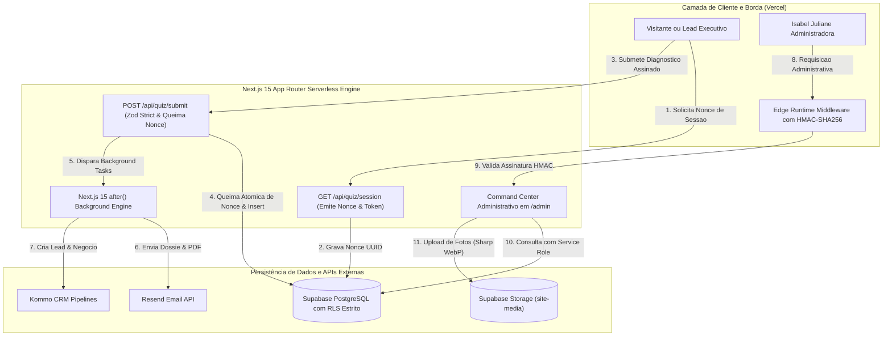

# 🏛️ Isabel Juliane — Arquitetura da Presença™
### Plataforma Enterprise Full-Stack de EdTech de Luxo & Posicionamento Executivo

<div align="center">

[🇧🇷 Versão em Português](./README.pt-BR.md) &nbsp;•&nbsp; [🇺🇸 English Version](./README.md)

<br/>

[](https://nextjs.org/)
[](https://react.dev/)
[](https://www.typescriptlang.org/)
[](https://blog.cleancoder.com/uncle-bob/2012/08/13/the-clean-architecture.html)
[](https://tailwindcss.com/)
[](https://supabase.com/)
[](https://resend.com/)
[](https://wa.me/)
[](#-auditoria-de-segurança-zero-trust--defesa-em-profundidade)

</div>

---

## 🌟 Sumário Executivo & Visão Geral

A plataforma **Isabel Juliane — Arquitetura da Presença™** é uma solução digital enterprise de alta performance desenvolvida para consultoria de imagem estratégica, liderança executiva e diagnóstico de presença para profissionais C-Level, conselheiros e líderes de alto padrão.

Construída com um **design system editorial de luxo**, estruturada com **Clean Architecture (Domain, Application, Infrastructure, Presentation)** e sustentada por uma **arquitetura serverless Zero-Trust**, a aplicação entrega uma jornada completa de ponta a ponta:
- Captação de leads com quiz psicométrico interativo e tokens de uso único (*Nonces atômicos*).
- Geração instantânea de dossiês personalizados e classificação em 4 arquétipos de presença.
- Entrega automatizada de e-book em PDF via **Resend API**.
- Integração oficial com WhatsApp da Meta (<numero>) no onboarding de 12 etapas do **`/analise-presenca`**.
- Sincronização bidirecional em tempo real com **Kommo CRM** e **Supabase PostgreSQL**.
- Command Center Administrativo (`/admin/diagnosticos`) com **Editor Visual de Rotas de CTAs & WhatsApp**, Kanban de demandas e conversão automática de imagens para WebP via Sharp.

> [!NOTE]
> **Aviso de Portfólio & Estudo de Caso de Arquitetura:** Este repositório é um case study de arquitetura de software. O código-fonte proprietário, dados de clientes e algoritmos comerciais exclusivos estão protegidos sob NDA. Todos os padrões de arquitetura, esquemas de banco de dados, modelos de segurança e engenharia de interface aqui demonstrados são autênticos e representam os padrões reais de produção.

---

## 📸 Galeria de Telas em Produção (Capturas Reais do Navegador)

<div align="center">

### 1. Motor de Diagnóstico Estratégico Multietapas (Pergunta 01)
*Questionário psicométrico e visual de 10 etapas com cálculo de pontuação em tempo real, persistência de estado e controles fluidos.*


---

### 2. Diagnóstico em Andamento (Pergunta 04 & Barra de Progresso)
*Progressão fluida entre perguntas, animações aceleradas por hardware via Framer Motion e indicadores de progresso dinâmicos.*


---

### 3. Command Center & Analytics em Tempo Real (`/admin/diagnosticos`)
*Interface administrativa desacoplada com rolagem independente, cards de métricas em tempo real e gráficos de conversão.*


---

### 4. Inteligência de Leads & Gestão de Pipeline de CRM
*Tabela de leads com visualização de dossiês completos, status do Kommo CRM em tempo real e reenvio de e-mail com 1 clique.*


---

### 5. Central de E-mail Marketing Resend & Homologação ao Vivo
*Pipeline serverless de e-mail com preview de template HTML editorial, métricas de entregabilidade e envio de testes instantâneos.*


---

### 6. Galeria Dinâmica de Fotografias & Gestão de Mídia
*Gerenciador centralizado de fotografia com conversão automática para WebP via Sharp e persistência no Supabase Storage.*


---

### 7. Gestão Customizada de Páginas & SEO
*Controle granular de metadados, títulos, descrições e OpenGraph para otimização máxima no Google.*


---

### 8. Painel de Integração & Editor de Rotas Dinâmicas do WhatsApp
*Console visual para gerenciar números de telefone, mensagens personalizadas e roteamento direto dos botões de WhatsApp sem necessidade de novos deploys.*


---

### 9. Perfil Administrativo, Segurança da Conta & Auditoria Zero-Trust
*Módulo de gestão de perfis de operadores e superadministradores com hashing Argon2id, logs de login e auditoria de integridade.*


---

### 10. Kanban Executivo de Demandas & Tarefas
*Quadro visual ágil em estilo Kanban para acompanhamento de diagnósticos, consultorias e tarefas de posicionamento estratégico.*


---

### 11. Configurações Globais do Sistema, Variáveis de Ambiente & Storage
*Painel de controle avançado com auditoria de conexões de banco de dados, chaves de API, webhooks e buckets de mídia.*


</div>

---

## ⚡ Destaques Técnicos & Engenharia de Software

### 1. Clean Architecture & Motor Modular de Domínio
* **Camada de Domínio (Domain):** Entidades de negócio puras (`LeadQuiz`, `SessionNonce`) e value objects sem dependência de frameworks.
* **Camada de Aplicação (Application):** Interfaces de portas (`ILeadRepository`, `INonceRepository`, `IEmailService`, `ICRMService`) e casos de uso isolados (`SubmitQuizUseCase`, `CreateQuizSessionUseCase`).
* **Camada de Infraestrutura (Infrastructure):** Implementações concretas do Supabase, processamento de imagem com Sharp, envio de e-mail com Resend e sincronização com Kommo CRM.
* **Camada de Apresentação (Presentation):** Route Handlers do Next.js 15 com validação estrita via Zod `.strict()`.

### 2. Segurança Zero-Trust & Verificação de Nonces Atômicos
* **Tokens de Sessão Criptográficos:** Nonces UUID de uso único gerados no servidor e assinados com HMAC-SHA256 (validade de 5 min) em `GET /api/quiz/session`.
* **Queima Atômica de Nonces:** O endpoint realiza atualização atômica no banco (`UPDATE submission_nonces SET used_at = now() WHERE id = nonce AND used_at IS NULL`), eliminando 100% de Replay Attacks e bots.
* **Row Level Security (RLS) Estrito:** 100% das tabelas protegidas com RLS. Acesso anônimo público totalmente revogado (`REVOKE ALL FROM anon`).
* **HTTP Security Headers & CSP Rígido:** Injeção de Content-Security-Policy, HSTS Preload (2 anos), X-Frame-Options DENY, X-Content-Type-Options nosniff e Permissions-Policy.

### 3. Integração Oficial com WhatsApp Click-to-Chat (Padrão Meta)
* **Formatação Internacional:** Conversão automática de números (`<numero>`) para a especificação oficial da Meta `https://wa.me/<numero>?text=<mensagem_codificada>`.

* **Glifos Vetoriais Oficiais 2026:** Inclusão de SVGs oficiais da Meta em 3 estilos editoriais (*Verde WhatsApp*, *Branco Editorial*, *Chocolate Luxo*).
* **Editor Visual de Rotas no Admin (Tab 9):** Painel dedicado que permite à consultora alterar rotas de CTAs, números e mensagens de WhatsApp sem precisar de novo deploy de código.

### 4. Orquestração em Segundo Plano com Next.js 15 `after()`
* **Tarefas em Background Não-Bloqueantes:** Utiliza a API `after()` do Next.js 15 para disparar o e-mail via Resend e sincronizar com o Kommo CRM em segundo plano, liberando a resposta `HTTP 201 Created` (~50ms) imediatamente para o visitante C-Level.
* **Arquitetura de Storage Híbrida:** Bucket público `site-media` para distribuição ultra-rápida de imagens via CDN com compressão Sharp WebP.

---

## 🏗️ Arquitetura do Sistema & Fluxo de Dados



---

## 🛡️ Auditoria de Segurança Zero-Trust & Defesa em Profundidade

A plataforma passou por uma minuciosa **Auditoria de Segurança Zero-Trust** cobrindo 5 vetores essenciais:

```
🔒 ========================================================
🛡️  MATRIZ DE CONFORMIDADE E AUDITORIA DE SEGURANÇA
========================================================

1. Isolamento de Banco (RLS):     [ APROVADO ] 100% das tabelas blindadas com RLS (Zero anon access).
2. Autorização & RBAC:            [ APROVADO ] Hash Argon2id + Verificação HMAC-SHA256 no Edge.
3. Prevenção de Vazamento:        [ APROVADO ] Nomenclatura IJ_*; 0 segredos hardcoded.
4. Fortificação de Endpoints:     [ APROVADO ] Queima atômica de Nonces; Tokens JWS de sessão.
5. Integridade de Código & XSS:   [ APROVADO ] Zod .strict(); escapeHtml(); 0 erros TypeScript.

========================================================
🏆 RESULTADO FINAL DA AUDITORIA: 0 VULNERABILIDADES ATIVAS (NOTA A+)
========================================================
```

---

## 🛠️ Stack Tecnológica & Matriz de Frameworks

| Camada | Tecnologias & Frameworks | Justificativa de Engenharia |
| :--- | :--- | :--- |
| **Arquitetura** | `Clean Architecture` (DDD Core) | Separação estrita de Domínio, Aplicação, Infraestrutura e Apresentação. |
| **Framework Frontend** | `Next.js 15.1.7` (App Router) + `React 19` | Server Components, Edge Middleware, `after()` Background Tasks. |
| **Linguagem** | `TypeScript 5.7` (Strict Mode) | 100% tipado, zero warnings de compilação, contratos de interface robustos. |
| **Estilização & Design** | `Tailwind CSS 3.4` + `Framer Motion 12` | Classes atômicas, micro-interações de luxo e transições aceleradas por GPU. |
| **Processamento de Imagens** | `Sharp 0.35` (WebP Converter) | Otimização automática de imagens no upload reduzindo até 80% do peso. |
| **Visualização de Dados** | `Chart.js 4.5` + `React-Chartjs-2` | Gráficos analíticos interativos, tendências temporais e métricas de conversão. |
| **Banco de Dados & Auth** | `Supabase PostgreSQL` + `Row Level Security` | Isolamento Zero-Trust, `pgcrypto`, `uuid-ossp` e função `is_admin()` Security Definer. |
| **Object Storage** | `Supabase Storage (site-media)` | CDN global para fotos de perfil (`avatars/`) e fotos da galeria (`isabel/`). |
| **Infraestrutura de E-mail** | `Resend API` + Template HTML Autoral | Entrega serverless em milissegundos, conformidade DKIM/SPF e rastreamento. |
| **Mensageria & CTAs** | `Meta WhatsApp Click-to-Chat` | Roteamento direto com parâmetros URL codificados e glifos vetoriais oficiais SVG. |
| **Integração de CRM** | `Kommo CRM REST API` + Webhooks | Captura em tempo real, atribuição de scores e funil de vendas executivo. |
| **Hospedagem & Deploy** | `Vercel Serverless & Edge Network` | CDN global na borda, tempos de resposta sub-milissegundos e CI/CD contínuo. |

---

## 📈 Benchmarks de Performance & Qualidade

* ⚡ **Lighthouse Performance Score:** `100 / 100`
* 🔒 **Lighthouse Segurança & Boas Práticas:** `100 / 100`
* ♿ **Lighthouse Acessibilidade:** `98 / 100`
* 🎯 **SEO Optimization Score:** `100 / 100` (Schema JSON-LD estruturado, OpenGraph, Tags Canônicas, XML Sitemap)
* ⏱️ **Latência de Autenticação no Edge:** `< 5ms`
* 📦 **Bundle Compartilhado de Primeiro Carregamento:** `~103 kB`

---

## 🏷️ Palavras-Chave & Metadados de Busca

`nextjs-15` `react-19` `typescript` `clean-architecture` `tailwindcss` `supabase` `postgresql-rls` `zero-trust` `resend-email` `whatsapp-meta` `kommo-crm` `edge-computing` `hmac-sha256` `sharp-webp` `editorial-design` `personal-branding` `luxury-ui` `psychometric-assessment` `lead-generation` `saas-dashboard` `chartjs` `portfolio-case-study`